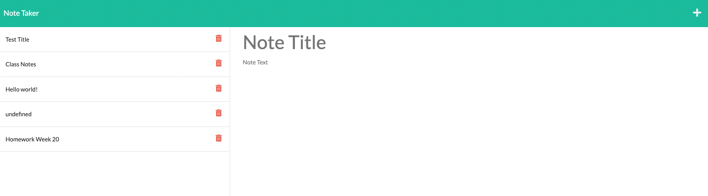

# Note Taker App

## Link to deployed application 
Github: <a href="https://racheldmarron.github.io/store-your-notes/">https://racheldmarron.github.io/store-your-notes/</a>  
Heroku: <a href="https://radiant-refuge-60728.herokuapp.com/">https://radiant-refuge-60728.herokuapp.com/</a>

## Overview 
I created a Note Taker application that allows users to write and save notes. This application uses Express.js on the backend to retrieve notes from a JSON file. 

## Summary of My Task & User Story 
This assigment had a user story of: AS A small business owner, I WANT to be able to write and save notes, SO THAT I can organize my thoughts and keep track of tasks I need to complete. 

The Acceptance Criteria included: 
<ul><li>When the note taker app is open, you are presented with a landing page with a link to the notes page</li>
<li>When you click into the notes page, you are presented with a list of existing notes plus the ability to add a new note title and text</li>
<li>When text is entered, there will be a save icon on the upper right nav that will allow you to save your notes with the existing notes</li>
<li>You are able to click the existing saved notes and be shown the full note in the right-hand column</li>
<li>There is a + icon on the top right nav that will allow you to create and save new notes</li></ul>

## How This Was Acheived
<ul>
<li>Using the existing code for HTML layout and function</li>
<li>I added a server.js file and npm installed express</li>
<li>I defined the port that the application will be hosted on (3001)</li>
<li>I created 3 app.get functions for the homepage, notes page, and api/notes page</li>
<li>I created a delete function that will let you delete the note by ID.</li>
<li>I pushed the application to Heroku, and pushed the repository to GitHub for code visibility.</li>
  </ul>

## Visual Representation 

## Contributors

- N/A

## License

This application is covered under MIT License    

- - -

© 2021 Rachel Delaney Marron, Inc. All Rights Reserved.
